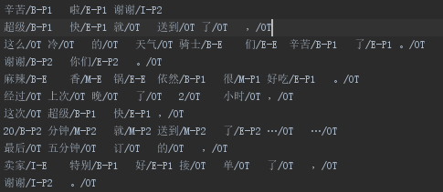
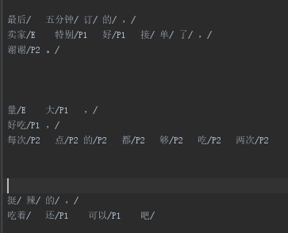

# 一、介绍
## 1、目的
通过四个步骤，即可完成一个特定领域的细粒度情感分析！

## 2、文件概述
- common_lib.py
提供常用方法（比如分词）和constants（比如正则、文件夹路径）
- corpus.py
处理语料
- HMM.py
做序列标注
- fgom
适用于 python3
- fgom2
适用于 python2

## 3、corpus.py
### class GetToTagCorpus
—— 得到需要标记的corpus。

- input_filename: 需要标记的语料文件readf
- output_filepath: 输出文件夹
- start: readf从哪一行开始输出
- end: readf从哪一行结束输出
- gap: 多少语料数写进一个文件

运行实例
    
    from fgom.corpus import GetToTagCorpus
    
    input_filename = "files/waimai_corpus.txt"
    output_filepath = "files/tag_corpus/"

    corpus = GetToTagCorpus(input_filename, output_filepath)
    corpus.run()

### class GetTaggedCorpus
—— 将已经人工标记了的corpus转换成标准形式。

- input_filepath： 人工标记
- output_filename: 输出文件名
- default='OT'： 对于没有标记的token，默认是default标签

运行实例

    from fgom.corpus import GetTaggedCorpus
    
    input_filepath = "files/tagged_corpus/"
    output_filename = "files/hmm_train_corpus.txt"

    corpus = GetTaggedCorpus(input_filepath, output_filename)
    corpus.run()

### class BootstrappingHMM
—— 做bootstrapping的HMM。在class BootstrappingMaster里用到。

### class BootstrappingMaster
—— 目的，扩大训练样本。

- bootstrapping_filename： 未标记的corpus
- origin_tag_filename： 已标记corpus

运行实例
    
    from fgom.corpus import BootstrappingMaster
    
    bootstrapping_filename = "files/bootstrap_corpus.txt"
    origin_tag_filename = "files/hmm_train_corpus.txt"

    bootstrap = BootstrappingMaster(bootstrapping_filename, origin_tag_filename)
    bootstrap.run()

## 4、HMM.py
### class OpinionMinerHMM
前面都是准备工作，这一步就是最重要的。首次需要初始化，提供train corpus，然后进行训练，训练结果会写进文件内，下次使用不需要再次训练。

- 初次使用

    
    
    from fgom import HMM
    
    corpus_filename = "files/hmm_train_corpus.txt"
    HMM.train(corpus_filename)

    sentence = "味道好，送餐快，分量足"
    print(HMM.tag(sentence))

运行结果
    
    ['I-E', 'I-P1', 'OT', 'I-E', 'I-P1', 'OT', 'I-E', 'I-P1']
    ['味道/I-E', '好/I-P1', '，/OT', '送餐/I-E', '快/I-P1', '，/OT', '分量/I-E', '足/I-P1']
    
- 下次使用

    from fgom import HMM
    
    sentence = "味道好，送餐快，分量足"
    
    print(HMM.tag(sentence))
    print(["%s/%s" % (word, tag) for word, tag in HMM.tag(sentence, False)])
    print(HMM.parse(sentence))
    
运行结果
    
    ['I-E', 'I-P1', 'OT', 'I-E', 'I-P1', 'OT', 'I-E', 'I-P1']
    ['味道/I-E', '好/I-P1', '，/OT', '送餐/I-E', '快/I-P1', '，/OT', '分量/I-E', '足/I-P1']
    {'pos1': ['好', '快', '足'], 'neg2': [], 'entity': ['味道', '送餐', '分量'], 'neg1': [], 'pos2': []}
    
- 再次训练，与初次使用一致。

    corpus_filename = "files/hmm_train_corpus.txt"
    HMM.train(corpus_filename)

# 二、实际使用
## 第一步： get to_tag_corpus

    import fgom
    
    input_filename = "files/waimai_corpus.txt"
    output_filepath = "files/tag_corpus/"
    fgom.get_to_tag_corpus(input_filename, output_filepath)

然后进行词性标注。要求的标注方式如下：

    E：Entity，实体、属性；
        I-E：Independent Entity
        B-E：Begining of the Entity
        M-E：Middle of the Entity
        E-E：End of the Entity
    P1：explicit positive sentiment words
        I-P1
        B-P1
        M-P1
        E-P1
    P2：implicit positive sentiment words， or positive description
        I-P2
        B-P2
        M-P2
        E-P2
    N1：explicit negative sentiment words
        I-N1
        B-N1
        M-N1
        E-N1
    N2：implicit negative sentiment words， or negative description
        I-N2
        B-N2
        M-N2
        E-N2
    OT：others
        I-OT
        B-OT
        M-OT
        E-OT
 
 
 
而手工进行标注的方式，只要求标注：
    
    E
    P1
    P2
    N1
    N2

## 第二步： get tagged_corpus

    import fgom
    
    input_filepath = "files/tagged_corpus/"
    output_filename = "files/hmm_train_corpus.txt"

    fgom.get_tagged_corpus(input_filepath, output_filename)

## 第三步： bootstrapping

    import fgom    
    
    bootstrapping_filename = "files/bootstrap_corpus.txt"
    origin_tag_filename = "files/hmm_train_corpus.txt"
    
    fgom.bootstrapping(bootstrapping_filename, origin_tag_filename)

## 第四步： train and use 

    import fgom
    
    corpus_filename = "files/hmm_train_corpus.txt"
    HMM.train(corpus_filename)

    print(fgom.tag(sentence))
    print(["%s/%s" % (word, tag) for word, tag in fgom.tag(sentence, False)])
    print(fgom.parse(sentence))

运行结果
    
    ['I-E', 'I-P1', 'OT', 'I-E', 'I-P1', 'OT', 'I-E', 'I-P1']
    ['味道/I-E', '好/I-P1', '，/OT', '送餐/I-E', '快/I-P1', '，/OT', '分量/I-E', '足/I-P1']

# 三、实例Demo
一个外卖领域的细粒度挖掘系统：[WaiMaiOpinionMiner](https://github.com/chaoming0625/WaiMaiOpinionMiner)

